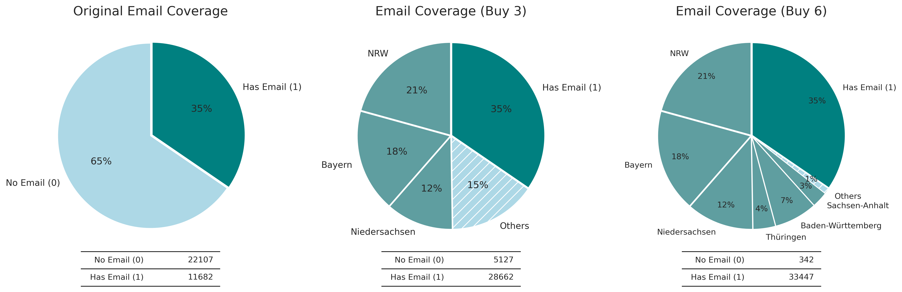
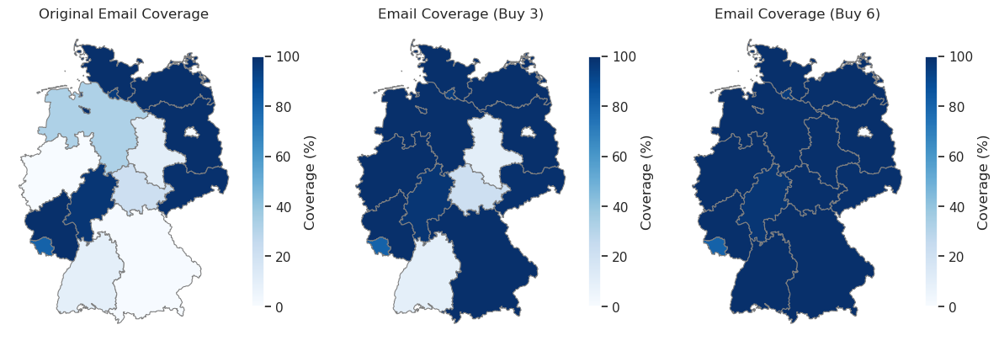

# school-data-scraping
# **Email Coverage Analysis for German Schools**

This repository contains a project developed during my time as a working student in 2021 for a German university. The task was to explore how to gather contact information for all general education schools across Germany to support a nationwide survey. The project includes web scraping, data preprocessing, and visualization to analyze email coverage and assess the need for third-party datasets.

---

## **Overview**

The project focuses on answering two key questions:

1. **For how many schools (per county) can we obtain email addresses?**  
2. **Should we buy additional datasets to improve coverage?**

To achieve this, the following steps were implemented:
- **Web scraping**: Extract URLs and school data from publicly available HTML files.
- **Data preprocessing**: Clean and encode the data to indicate email availability.
- **Analysis**: Calculate email coverage per county (`Bundesland`) and explore scenarios to improve coverage.
- **Visualization**: Generate plots and geographic maps to support decision-making.

---

## **Data**

### **Source**
- The data was originally extracted from [schulliste.eu](http://www.schulliste.eu) in 2021.
- Archived datasets from 2021 were used to supplement scraping due to structural changes in the source website.

### **Structure**
The dataset includes:
- **Bundesland** (county)
- **Email availability** (binary encoded: 1 = available, 0 = not available)
- Additional metadata such as school type and categories.

---

## **Visualization**




## **Key Findings**

1. **Email Coverage**:  
   - Out of 33,789 schools, only 11,682 (~35%) had email addresses in the dataset.
   - Coverage varies widely across counties. For instance, Bayern and Nordrhein-Westfalen had almost no coverage, while some counties achieved near-complete coverage.

2. **Recommendations**:  
   - To increase coverage, purchase third-party data for counties with the most missing emails.
   - Adding data for Nordrhein-Westfalen, Bayern, and Niedersachsen could raise coverage to ~85%.  
   - Additionally including Thüringen, Baden-Württemberg, and Sachsen-Anhalt would achieve ~99% coverage.

---


## **How to Use**

### **Setup**
1. Clone the repository:
   
   ```bash
   git clone git@github.com:NoKryst13/school-data-scraping.git
   cd school-data-scraping
   ```

### **Install Dependencies**
2. Install the required packages:  
	```pip install -r requirements.txt```

### Run the Notebook
3. Open Jupyter Notebook to explore and execute the project (school_data_analysis.ipynb):  
	```jupyter notebook```